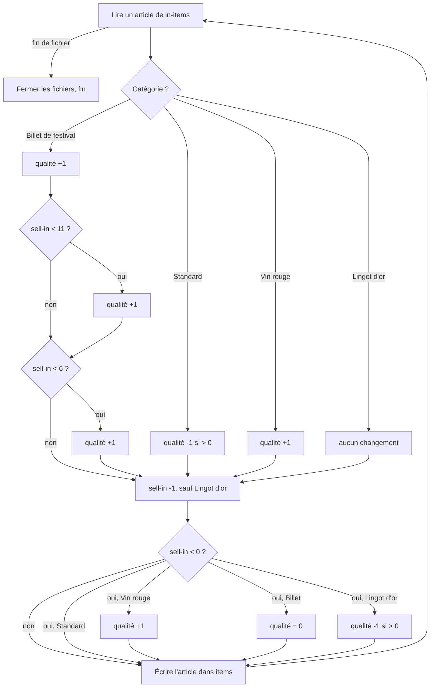

# Flux de traitement d'un article

Déroulé de `cobol/Gnu/Inventaire.cbl` pour un enregistrement lu dans `in-items`. Chaque `+1` n'est appliqué que si la qualité est inférieure à 50.

```mermaid
flowchart TD
    R[Lire un article de in-items] -->|fin de fichier| F[Fermer les fichiers, fin]
    R --> C{Catégorie ?}
    C -->|Standard| S1[qualité -1 si > 0]
    C -->|Lingot d'or| L1[aucun changement]
    C -->|Vin rouge| V1[qualité +1]
    C -->|Billet de festival| B1[qualité +1]
    B1 --> B2{sell-in < 11 ?}
    B2 -->|oui| B3[qualité +1]
    B2 -->|non| B4
    B3 --> B4{sell-in < 6 ?}
    B4 -->|oui| B5[qualité +1]
    B4 -->|non| D
    B5 --> D
    S1 --> D
    V1 --> D
    L1 --> D
    D[sell-in -1, sauf Lingot d'or] --> E{sell-in < 0 ?}
    E -->|non| W[Écrire l'article dans items]
    E -->|oui, Vin rouge| E1[qualité +1]
    E -->|oui, Billet| E2[qualité = 0]
    E -->|oui, Lingot d'or| E3[qualité -1 si > 0]
    E -->|oui, Standard| W
    E1 --> W
    E2 --> W
    E3 --> W
    W --> R
```
